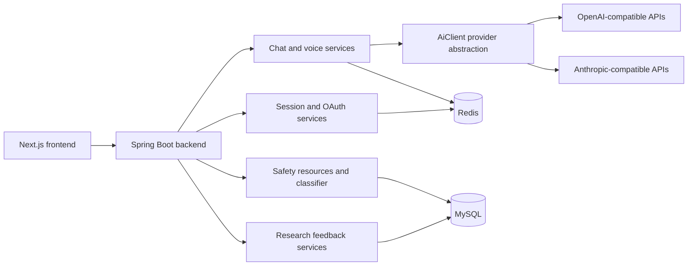

# Minsi.ai

Minsi.ai is a privacy-first AI companion for students who want a calmer way to reflect on stress, emotions, and digital identity.

Live demo: https://minsi.ai  
Status: active development

## Why This Exists

Many students have thoughts they do not know how to say out loud. Minsi.ai explores whether an AI product can help with that first step: naming a feeling, slowing down a stressful moment, or organizing a messy thought without turning private reflection into permanent data.

The product is built around three constraints:

- Emotional support should feel quiet and low-pressure, not clinical or performative.
- Private chat and voice interaction should not become a long-term profile of the user.
- Safety resources and research feedback should be handled separately from private conversation.

Minsi.ai is not medical care or a crisis service. It is a product experiment in reflection, emotional UX, and privacy-conscious AI interaction.

## What I Built

I designed and implemented the product across the main product and engineering layers:

- Product flow: home, about, privacy and safety, research feedback, login, text chat, voice chat, and admin moderation.
- Frontend: Next.js App Router pages, responsive UI, protected chat entry, text and voice chat surfaces, and research feedback views.
- Backend: Java Spring Boot APIs for auth/session, OAuth QR login, chat, voice, safety resources, research feedback, and admin moderation.
- AI layer: provider abstraction through `AiClient`, with OpenAI-compatible and Anthropic-compatible clients behind the same service boundary.
- Prompt and safety design: companion prompt configuration, safety classification, safety resources, and explicit limits around output and context.
- Privacy boundary: zero-persistence handling for chat and voice content, plus sanitized logging and separate persistence for moderated research feedback.

## Product Surfaces

| Surface | Route or area | What it demonstrates |
| --- | --- | --- |
| Home | `/` | Product positioning, language switching, and entry into the chat experience. |
| Text chat | `/chat` | Login-gated reflection chat, loading/error/retry states, and request-local conversation context. |
| Voice chat | `/chat/voice` | Temporary voice session handling, transcription flow, and handoff into the chat service. |
| Research feedback | `/research` | Anonymous feedback submission, approved-only public display, and separation from private chat. |
| Privacy and safety | `/privacy` | User-facing explanation of privacy boundaries, safety expectations, and product limits. |
| Admin moderation | `/admin`, `/admin/feedback` | Login-gated moderation tools for reviewing research feedback before public display. |

The live demo is the best current visual reference. Static screenshots will be added after the UI stabilizes; they should be full-page captures from real product routes, not raw design assets.

## Architecture



| Layer | Main choices |
| --- | --- |
| Frontend | Next.js 15, React 18, TypeScript, Tailwind CSS, pnpm |
| Backend | Java 21, Spring Boot 3, Spring Security, MyBatis-Plus, Maven |
| Data | MySQL for approved persistent product data; Redis for temporary session/rate-limit state |
| AI boundary | `AiClient` abstraction, prompt configuration, provider-specific clients behind services |
| Auth | Cookie-based sessions, OAuth QR login flow, protected chat and admin routes |
| Privacy | Request-local chat/voice text, no raw private conversation persistence, sanitized logs |

## Privacy Boundary

The central engineering rule is that chat and voice content are zero-persistence data.

The backend should not store, log, cache, trace, export, or back up raw user messages, AI replies, voice transcripts, emotion text, prompts, or chat-derived profiles. Voice transcripts are request-local and are forwarded into the chat flow without being saved.

The intentionally persisted long-text path is `research_feedback`. It is separate from private chat, inserted as unapproved by default, and only approved entries can be displayed publicly.

## Running Locally

Requirements:

- Node.js 20 or another version supported by Next.js 15
- pnpm 11
- Java 21
- Maven 3.9+
- MySQL 8
- Redis

Frontend:

```bash
pnpm install
cp .env.example .env
pnpm dev
```

Backend:

```bash
cd backend
cp .env.example .env
mvn test
mvn spring-boot:run
```

The backend imports `optional:file:.env[.properties]` and `optional:file:backend/.env[.properties]`. Do not shell-source `.env` files.

## Current Status

Implemented or in progress:

- Public site pages and responsive product UI
- Login-gated text chat and voice chat entry
- Chat service with AI provider abstraction
- Voice session and transcription flow with request-local transcript handling
- Research feedback API and moderation flow
- Admin authentication and feedback moderation pages
- Safety resources and privacy rules around private content

Next steps:

- Add CI checks for frontend and backend builds
- Add a dependency CVE scan for release preparation
- Expand production observability without logging private content
- Capture stable screenshots from deployed product routes
- Continue user testing around clarity, tone, and safety copy

## Repository Notes

The GitHub profile README is intentionally short. This file is the project-oriented overview for the Minsi.ai codebase.

Real `.env` files, private keys, database dumps, logs, build output, dependency directories, and local certificates should never be committed.
